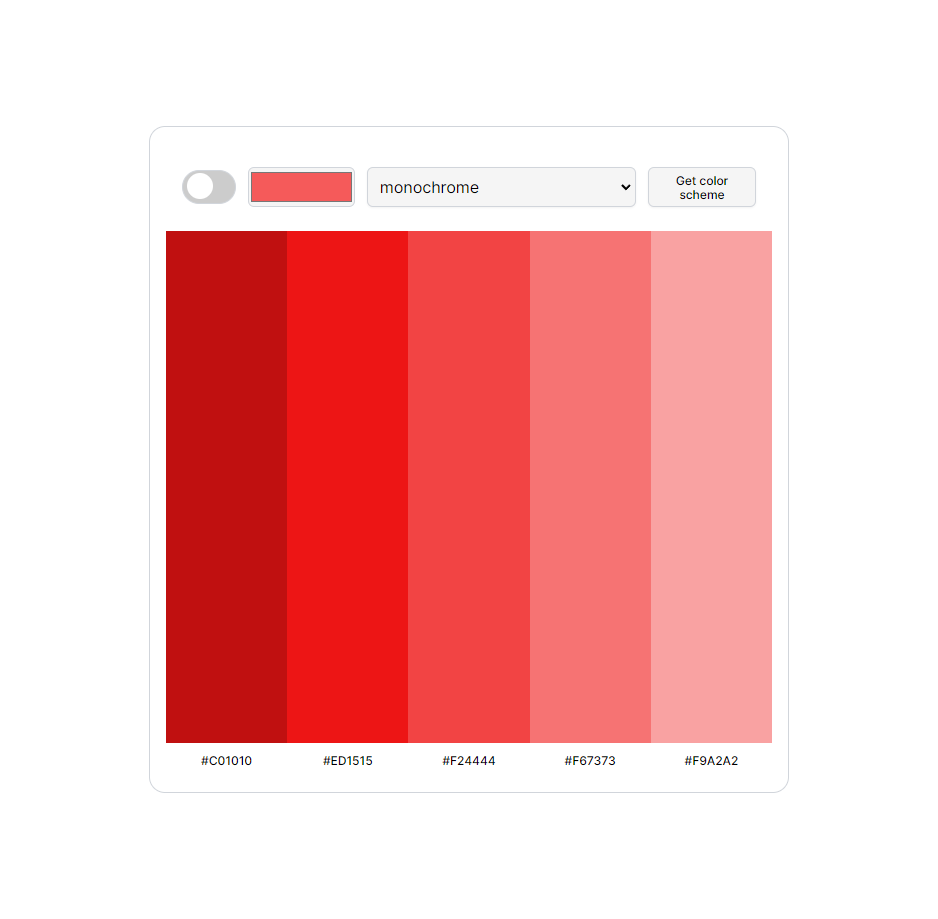

# color-scheme-generator
Generate or browse the perfect color schemes for your designs.

## Demo link:
Access my site at [https://color-scheme-generator-12.netlify.app/](https://color-scheme-generator-12.netlify.app/)

## Overview
A simple color scheme gernator that allows you to search, discover, test and create beautiful color palettes for your projects. It uses the [Color API](https://www.thecolorapi.com/) to generate a color scheme based on the user inputs. 

### Features
Users are allowed to:
- Toggle the switch for Dark Mode
- Select a color from the Color pallette
- Select a mode from the Scheme picker
- Generate a color scheme with the submit button
- Click on one of the five colors to copy its hex value to the clipboard

### Built with
- HTML
- CSS
- JavaScript
- Figma
- REST API

## Setup
- download or clone the repository
- visit the site [Demo link](#demo-link)

## Approach
I first created the HTML layout by creating a container <main> to hold the content of my application. With the help of flexbox I was able to create my navbar that consisted the main parts for user inputs. Then with grid I dynamically rendered the color-schemes and color-hex numbers as I was getting the response back from the color API. 

I then broke down each part into it's own function for reabiliity and refactoring later when we want to add new features, such as the Dark Mode Switch. The functions were broken down to those that getHTML, those that render the HTML, and those that listen for submit or color clicks. 

Through this project we learned how to use REST API's method to request for some resources. The color API had two endpoints one for getting a color with a URL parameter of "/id" and another for getting a scheme with a URL parameter "/scheme".

The most difficult part was figuring out how to selectively know which color was clicked on (for the purpose of copying onto our clipboard) since they were dynamiclly rendered there was no way to give each one a unique className inside the `.map` method. So, my solution was to give each color a `data attribute` as we loop through the colors array. Now at anytime we can check and validate by looking if an element we clicked on has a data attribute of the one we set, which is also the hex value we need to copy! 

## Connect

Thank you for reading about this project. If you'd like to connect with me for mentoring, collaboration, or employment opportunities, you can do so via the following links:

- Email [Youkwhan@gmail.com](**Youkwhan@gmail.com**)
- LinkedIn [https://www.linkedin.com/in/youkwhan/](https://www.linkedin.com/in/youkwhan/)
- Portfolio [https://devyouk.netlify.app](https://devyouk.netlify.app)

### License
This project is licensed under the [MIT License](LICENSE.md).
